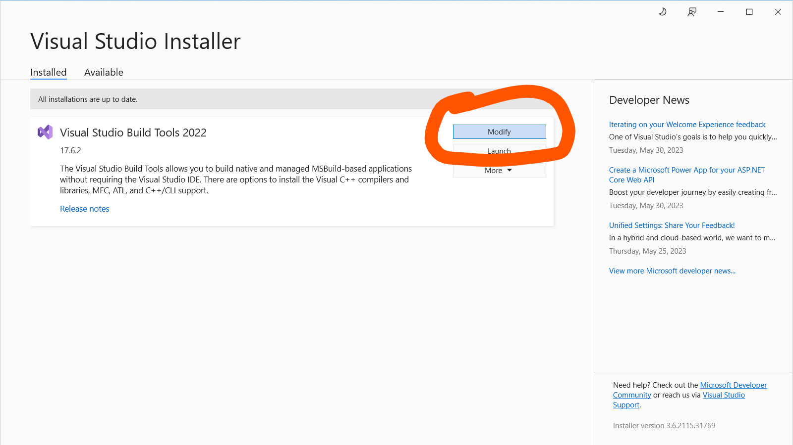
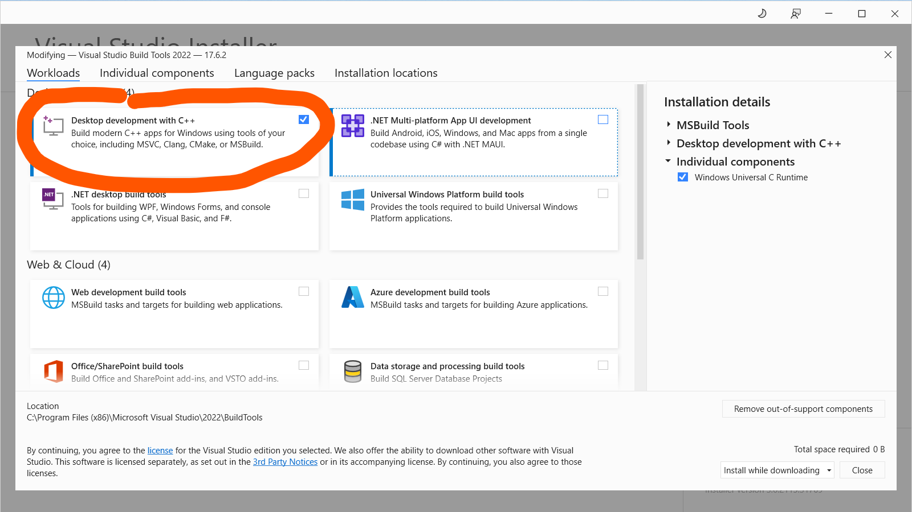
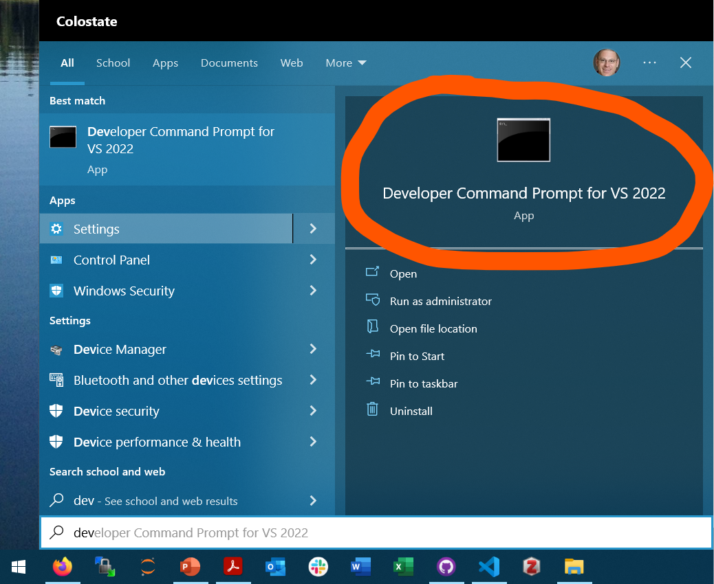

# ShimDLL
A C project on window to insert a shim into the RP1210 driver path. There is a simple program with little functionality called [simpleRP1210.c](simpleRP1210.c) that uses an RP1210 device to connect to a vehicle network and read the VIN.

Another program builds a ShimDLL that interfaces with a Python program to perform machine-in-the-middle attacks.

## Quick Start
Here are the brief steps to get started:
1. Install the Desktop development with C++ workload from Microsoft Visual Studio Build Tools.
2. Launch the Developer Command Prompt for VS
3. Navigate to this repository (e.g. ```cd  %USERPROFILE%\Documents\GitHub\ShimDLL\```)
4. Compile the source: ```cl.exe simpleRP1210.c```
The output may be something like this:
```
Microsoft (R) C/C++ Optimizing Compiler Version 19.36.32532 for x86
Copyright (C) Microsoft Corporation.  All rights reserved.

simpleRP1210.c
simpleRP1210.c(97): warning C4113: 'FARPROC' differs in parameter lists from 'READVERSION'
simpleRP1210.c(98): warning C4113: 'FARPROC' differs in parameter lists from 'GETERRORMESSAGE'
simpleRP1210.c(99): warning C4113: 'FARPROC' differs in parameter lists from 'CLIENTCONNECT'
simpleRP1210.c(100): warning C4113: 'FARPROC' differs in parameter lists from 'CLIENTDISCONNECT'
simpleRP1210.c(101): warning C4113: 'FARPROC' differs in parameter lists from 'SENDCOMMAND'
simpleRP1210.c(102): warning C4113: 'FARPROC' differs in parameter lists from 'READMESSAGE'
simpleRP1210.c(103): warning C4113: 'FARPROC' differs in parameter lists from 'SENDMESSAGE'
Microsoft (R) Incremental Linker Version 14.36.32532.0
Copyright (C) Microsoft Corporation.  All rights reserved.

/out:simpleRP1210.exe
simpleRP1210.obj
```
5. Connect an RP1210 device to a J1939 network (e.g. DGDPAXL)
6. Run the command. For example ```simpleRP1210.exe DGDPAXL.dll 1```. The output should look something like this:
```
Starting the simpleRP1210 program.
Command-line Arguments:
argv[0]: simpleRP1210.exe
argv[1]: DGDPAXL.dll
argv[2]: 1
The name for the RP1210 driver to be used is DGDPAXL.dll
The RP1210 Device ID selected is 1
argument substring is .dll
Great! The first command line argument has .dll in it. There's a chance it is an RP1210 filename.
Loading external RP1210 library...done.
Loading RP1210 functions...done.
Using RP1210_ReadVersion...done.
DLL Major Version: 3
DLL Minor Version: 2
API Major Version: 5
API Minor Version: 0
Using RP1210_ClientConnect...done.
The J1939 Client Identifier is 0
Using RP1210_SendCommand for set filters to pass...done.
The return code for setting filters to pass is 0
91 B1 5B 5B 04 F0 00 03 00 FF F8 7D 7D 00 00 00 F0 7D   °}}   ≡}
91 B1 83 65 04 F0 00 03 00 FF F8 7D 7D 00 00 00 F0 7D   °}}   ≡}
91 B1 8F 1D 0E F0 00 06 00 FF FF FF 32 5B FF FF FF FF     2[    
91 B1 91 11 03 F0 00 03 00 FF D1 00 00 FF FF FF 00 FF   ╤       
...
91 D7 4B C2 94 FD 00 06 00 FF 00 00 FF FF 00 00 FF FF           
91 D7 4D B6 FD FC 00 04 00 FF FF FF FF FF 29 64 FF FF       )d  
91 D7 50 27 F2 FE 00 06 00 FF 00 00 00 FE FF FF FE FF      ■  ■ 
91 D7 52 98 F0 FE 00 06 00 FF FF FF FF 00 00 C0 FF FF        └  
91 D7 54 8C 96 FE 00 06 00 FF 0C FA FF FF FF FF FF FF   ♀·      
91 D7 5A E5 04 F0 00 03 00 FF F8 7D 7D 00 00 00 F0 7D   °}}   ≡}
91 D7 78 AE EC FE 00 86 00 FF 31 48 53 48 57 53 4A 4E 58 44 4A 31 39 35 35 35 35 2A   1HSHWSJNXDJ195555*
Found PGN 65260

Program ending.
Number of SendMessages 1
Number ReadMessages 908
```

Use your favorite editor to make changes. 

### Compiler Installation

This is a C project on Microsoft Windows. It has to be on Windows because the RP1210 devices only run on Windows.

The compiler for this project is the MSVC compiler that run from the command prompt with the program called `cl.exe`.

To install the compiler, download the Build Tools Microsoft Visual Studio 2022. 

https://visualstudio.microsoft.com/downloads/#build-tools-for-visual-studio-2022

Running the installer should give a window that looks like this and you can select the Modify button.


Visual Studio is pretty big, so we want to keep the installation minimal. Select only the Desktop development with C++ under the Workloads tab, then press install or close.


This should setup our build environment in Windows.


### Visual Studio Code
Follow these instructions to get your build environment setup with Visual Studio Code.

https://code.visualstudio.com/docs/cpp/config-msvc


A most important aspect of this is to launch VScode from the Developer Command Prompt

Be sure `%USERPROFILE%\AppData\Local\Programs\Microsoft VS Code` is in your system path.



# Making a Shim DLL
The conceptual idea of the ShimDLL is for the ShimDLL to present itself to a legitimate program. The ShimDLL will then connect to the real RP1210 driver to keep all the functionality. The ShimDLL will communicate with the legitimate program using local sockets for interprocess communications.
